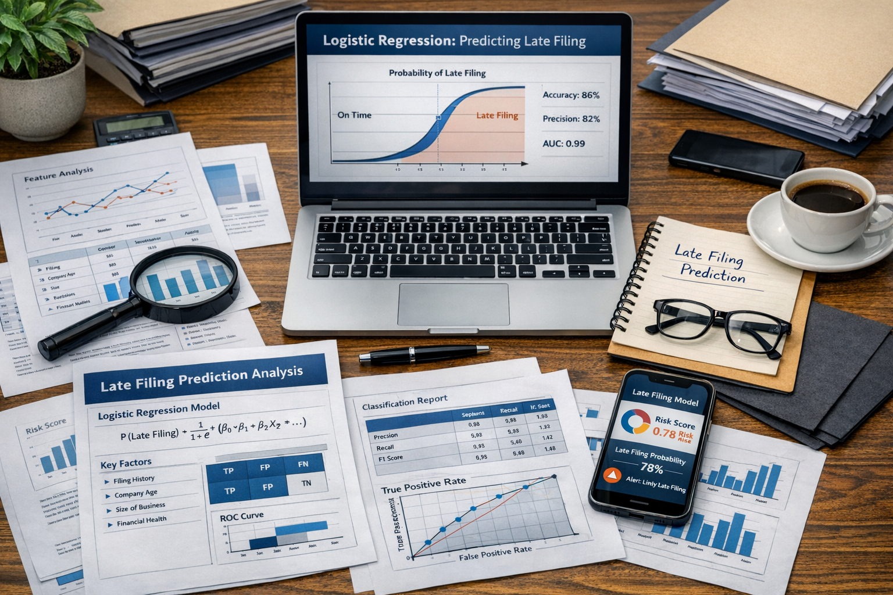
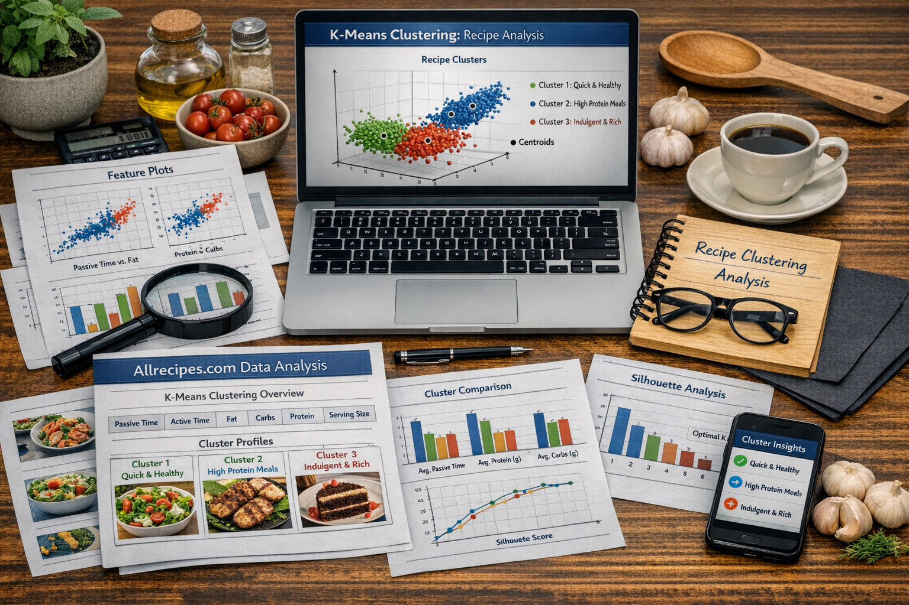

# Data Scientist
Data Science Professional Practice Module Portfolio

### About me
This will be more curated when I consider what information I would like to put out there.

I am currently in the first year of a 3-year Level 6 **Data Science** degree apprenticeship course. [Redirect link to Github Profile Page](https://bp0323904.github.io/dspp/)

I have completed 4 modules and demonstrated skills in the following areas:

| Area | Skills |
|-----|-----|
| **Data engineering** | ETL processing in Power Query for PowerBI and Jupyter Notebooks for Python |
| **Data visualisation and dashboarding** | PowerBI dashboarding with interactive visualisations   Data visuals in Python using Jupyter Notebooks |
| **Data analytics** | Linear regression and logistic regression modelling in Python using Jupyter Notebooks |

## Education
I have done a lot of courses and I'm self taught in a lot of things. I will update this when I can think more clearly about what I would like to put out there.

## Projects

| Type | Logistic Regression &nbsp;&nbsp;&nbsp;&nbsp;&nbsp;   
  
   Companies House Logistic Regression AI Generated Image | K-Means Clustering   
  
   K-Means Clustering of Allrecipes Data AI Generated Image|
|------|--------|-------|
| **Quesion** | To what extent can company structure and ownership variables be used to predict late filing behaviour in UK companies using logistic regression, as an indicator of regulatory non-compliance? | How effectively can K-Means clustering be applied to segment recipes, based on macronutrient composition and preparation time, in order to support time-constrained individuals in making nutritionally informed choices? |
| **Github Links** | [Logistic Regression with Companies House Data](https://github.com/BP0323904/dspp/tree/main/Companies_House) | [Clustering recipes with data from https://www.allrecipes.com/](https://github.com/BP0323904/dspp/tree/main/Allrecipes) |
| **Data Sources** | [Companies House - Free Company Product](https://download.companieshouse.gov.uk/en_output.html)   [People with Significant Control (PSC) Snapshot](https://download.companieshouse.gov.uk/en_pscdata.html) | [all_recipes.csv](https://raw.githubusercontent.com/owlzyseyes/tastyR/refs/heads/main/data-raw/allrecipes.csv) |
| **Scripts**        | [Get Data](https://github.com/BP0323904/dspp/blob/main/Companies_House/Notebooks/CH_Get_Data.ipynb)   [EDA and Data Cleansing](https://github.com/BP0323904/dspp/blob/main/Companies_House/Notebooks/CH_EDA_and_Cleansing.ipynb)   [Logistic Regression Modelling](https://github.com/BP0323904/dspp/blob/main/Companies_House/Notebooks/CH_Log_Reg_Model.ipynb) | [EDA and Cleansing Notebook](https://github.com/BP0323904/dspp/blob/main/Allrecipes/Notebooks/Allrecipes_EDA_and_Cleansing.ipynb) |
