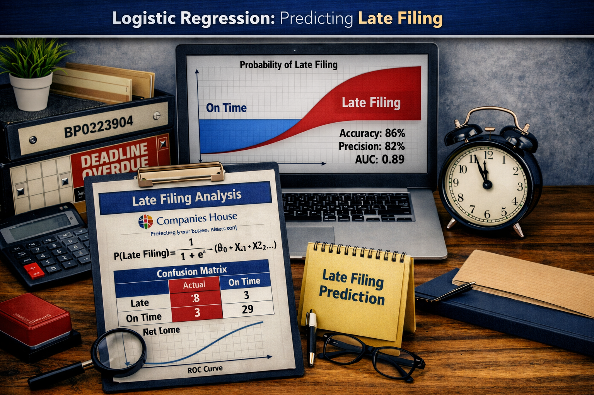

# Data Science Professional Practice Portfolio

  

### About me
I am currently in the first year of a 3-year Level 6 **Data Science** degree apprenticeship course and have completed modules demonstrating skills in the following areas:

| Area | Skills |
|-----|-----|
| **Data Infrastructure and Tools** | Understanding of different data ecosystems, roles and responsibilities of data professionals. |
| **Data Engineering** | ETL processing in Power Query for PowerBI and Jupyter Notebooks for Python |
| **Data Visualisation and Dashboarding** | PowerBI dashboarding with interactive visualisations   Data visuals in Python using Jupyter Notebooks |
| **Data Analytics** | Linear Regression modelling in Python using Jupyter Notebooks   Logistic Regression modelling in Python using Jupyter Notebooks   K-Means Clustering in Python using Jupyter Notebooks |

### Public Projects

| Type | Logistic Regression - Companies House   
  
 AI Generated Image | K-Means Clustering - Allrecipes   
  
 AI Generated Image|
|-----------|--------------------|--------------------|
| **Question** | To what extent can company structure and ownership variables be used to predict late filing behaviour in UK companies using logistic regression, as an indicator of regulatory non-compliance? | How effectively can K-Means clustering be applied to recipe segmentation, based on macronutrient composition and preparation time, in order to support time-constrained individuals in making nutritionally informed choices? |
| **Overview** | I used logisitc regression on Companies House data to test whether company structure and ownership features could predict the probability that a company would file its accounts late. After cleansing and engineering dataset features, I identified the most effectiove model (*class-weighted logistic regression*) and optimal threshold (*0.52*) using a training sample of the original population. I then applied the model to a test sample of the original population to further analyse. Finally, I applied the same model to the remaining unseen population to develope a risk ranked population and a profile of the Very-High-Risk group. The analysis demonstrates clear potential for future expansion, including identification of potential future non-compliant companies which could be used for targetted support or interventions for companies most likely to become non-compliant. | I used K‑Means clustering to group Allrecipes.com recipes by macronutrient, time and recipe size. After cleansing and engineering features (active/passive time, serving size, proportional macros), I identified **5** meaningful clusters ranging from quick-everyday meals to long‑fermentation preserved foods. External validation showed strong thematic consistency, and the results provide a foundation for personalised recipe recommendations, meal‑planning tools, and automatic tagging on recipe platforms. |
| **Github Links** | [Logistic Regression with Companies House Data](https://github.com/BP0323904/dspp/tree/main/Companies_House) | [Clustering recipes with data from https://www.allrecipes.com/](https://github.com/BP0323904/dspp/tree/main/Allrecipes) |
| **Data Sources** | [Companies House - Free Company Product](https://download.companieshouse.gov.uk/en_output.html)   [People with Significant Control (PSC) Snapshot](https://download.companieshouse.gov.uk/en_pscdata.html) | [raw source data - all_recipes.csv](https://raw.githubusercontent.com/owlzyseyes/tastyR/refs/heads/main/data-raw/allrecipes.csv) |
| **Scripts** | **Jupyter Notebook Scripts:**   [Get Data](https://github.com/BP0323904/dspp/blob/main/Companies_House/Notebooks/CH_Get_Data_Final.ipynb)   [EDA and Data Cleansing](https://github.com/BP0323904/dspp/blob/64e54a0f6386358e92eeec141cca076a21e987ab/Companies_House/Notebooks/CH_EDA_and_Cleansing_Final.ipynb)   [Logistic Regression Modelling](https://github.com/BP0323904/dspp/blob/main/Companies_House/Notebooks/CH_Log_Reg_Model_Final.ipynb)    **Interactive Visualisation:**   [Interactive class-weighted precision recall curve html](https://github.com/BP0323904/dspp/blob/main/Companies_House/Notebooks/class_weighted_pr_curve.html)   [static version of the interactive class-weighted precision recall curve png](https://github.com/BP0323904/dspp/blob/main/Companies_House/Notebooks/class_weighted_pr_curve.png)    **src/ .py helper files**   [__init.py__](https://github.com/BP0323904/dspp/blob/main/Companies_House/src/__init__.py)  [utils.py](https://github.com/BP0323904/dspp/blob/main/Companies_House/src/utils.py)   [visualisations.py](https://github.com/BP0323904/dspp/blob/main/Companies_House/src/visualisations.py) | **Jupyter Notebook Scripts:**   [K-Means Clustering Notebook](https://github.com/BP0323904/dspp/blob/main/Allrecipes/Notebooks/Allrecipes_K_Means_Clustering.ipynb)    **Interactive Visualisation:**   [Interactive Calories vs Atwater Scatterplot html](https://github.com/BP0323904/dspp/blob/main/Allrecipes/Notebooks/calories_vs_atwater_interactive.html)   [Static version of the interactive Calories vs Atwater Scatterplot png](https://github.com/BP0323904/dspp/blob/main/Allrecipes/Notebooks/calories_vs_atwater_interactive.png)    **src/ .py helper files**   [__init.py__](https://github.com/BP0323904/dspp/blob/main/Allrecipes/src/__init__.py)   [utils.py](https://github.com/BP0323904/dspp/blob/main/Allrecipes/src/utils.py)   [clustering.py](https://github.com/BP0323904/dspp/blob/main/Allrecipes/src/clustering.py)   [visualisation.py](https://github.com/BP0323904/dspp/blob/main/Allrecipes/src/visualisation.py)|
